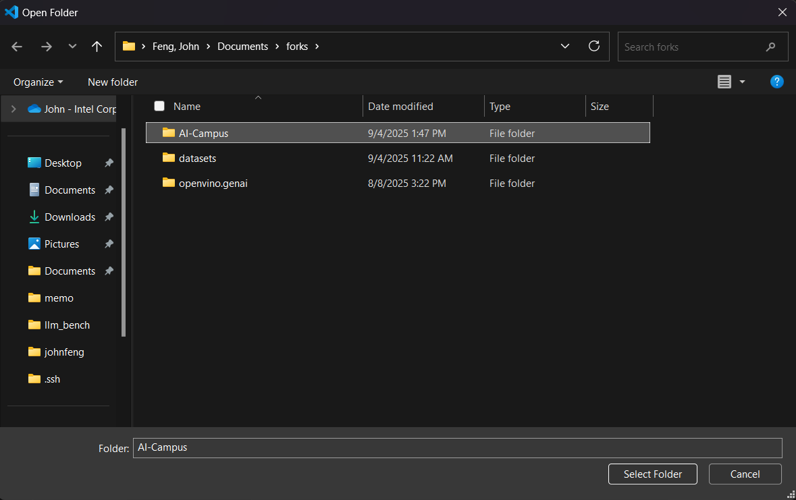
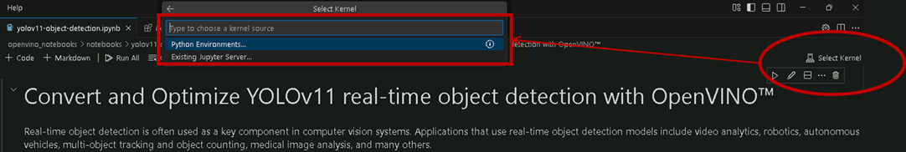
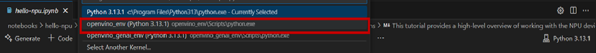

<h1>📚 Campus AI Notebooks</h1>
[](https://github.com/openvinotoolkit/openvino_notebooks/blob/latest/LICENSE)


>Note: Most content of this repository is extracted from [OpenVINO™ Notebooks at GitHub Pages](https://openvinotoolkit.github.io/openvino_notebooks/) and modified for Campus AI program for AI PC. If you would like to have more sample and use case based on OpenVINO™, please visit [OpenVINO™ Notebooks at GitHub Pages](https://openvinotoolkit.github.io/openvino_notebooks/).


## 📝 Installation Guide

Campus AI require Python and Git. To get started, please following below contents.

Please skip Steps 1 and 2 if you already installed Python3 and Git on Windows.

### 1. Install Python, Git and VSCode

#### 1.1 Install Python
> **NOTE:** ⚠️The version of Python that is available in the Microsoft Store is not recommended.⚠️ It may require installation of additional packages to work well with OpenVINO and the notebooks.

* Download a Python installer from python.org. Choose Python 3.9, 3.10, 3.11 or 3.12 and make sure to pick a 64-bit version. For example, this 3.12.10 installer: 
https://www.python.org/ftp/python/3.12.10/python-3.12.10-amd64.exe
* Double-click on the installer to run it, and follow the steps in the installer. **Check the box to add Python to your PATH**, and to install `py`. At the end of the installer, there is an option to disable the PATH length limit. It is recommended to click this.

#### 1.2 Install Git 

* Download [GIT](https://git-scm.com/) from [this link](https://github.com/git-for-windows/git/releases/download/v2.50.1.windows.1/Git-2.50.1-64-bit.exe)
* Double click on the installer to run it, and follow the steps in the installer.

#### 1.3 Install VSCode

* Download [VSCode](https://code.visualstudio.com/) from [this link](https://code.visualstudio.com/Download#)
* Double click on the installer to run it, and follow the steps in the installer.

### 2. Install Drivers for GPU, and NPU (AI PC)

We recommend A "Clean Install" of the WHQL Certified GPU driver to ensure the underlying libraries are correctly configured. 
https://www.intel.com/content/www/us/en/download/785597/834050/intel-arc-iris-xe-graphics-windows.html

Additionally, for AI PC users, please install the latest NPU driver to avoid any potential issues in compiling NPU kernels.
https://www.intel.com/content/www/us/en/download/794734/intel-npu-driver-windows.html


### 3. Install C++ Redistributable (required) and FFMPEG (optional)

#### 3.1 C++ Redistributable (required)

* Download [Microsoft Visual C++ Redistributable](https://aka.ms/vs/17/release/vc_redist.x64.exe).
* Double click on the installer to run it, and follow the steps in the installer.

#### 3.2 FFMPEG (optional)

* Download FFMPEG binary from here (https://ffmpeg.org/download.html)
* Set FFMPEG's path (e.g., C:\ffmpeg\bin) to the PATH environmental variable on Windows. 

### 4. Clone the Repository and construct virtual environments

After installing Python 3 and Git, run each step below using _Command Prompt (cmd.exe)_, not _PowerShell_.

#### 4.1 Clone the Repository

> Note: Using the --depth=1 option for git clone reduces download size.

```bash
git clone --depth=1 https://github.com/JohnLeFeng/AI-Campus.git
cd AI-Campus
```

#### 4.2 Construct virtual environments

Run below 2 scripts which will help you to construct python virtual environments, `openvino_env` and `openvino_genai_env` for different use case.

* Build OpenVINO™ virtual environments

	```bash
	virtualenvs\build_ov_env.bat
	```

* Build OpenVINO™ GenAI virtual environments

	```bash
	virtualenvs\build_ov_genai_env.bat
	```

### 5. Launch the Notebooks

Please following below step to use VSCode to launch it.

* Via File -> Open Folder -> Select AI-CAMPUS

	

* Double-click to Open Notebook and select python kernel

	

	

	> Note:
	> 	Please following below table to select different kernel to execute different use case.
	>	| Use Case | Notebook | Kernel |
	>	|----------|----------|--------|
	>	| hello-npu | `hello-npu.ipynb` | openvino_env |
	>	| yolov8-optimization | `yolov8-object-detection.ipynb` |  openvino_env |
	>	| llm-chatbot | `llm-chatbot.ipynb` | openvino_genai_env |
	>	| llm-chatbot | `llm-chatbot-generate-api.ipynb` | openvino_genai_env |
	>	| text-to-image-genai | `text-to-image-genai.ipynb` | openvino_genai_env |

* After it, you can run notebooks.
